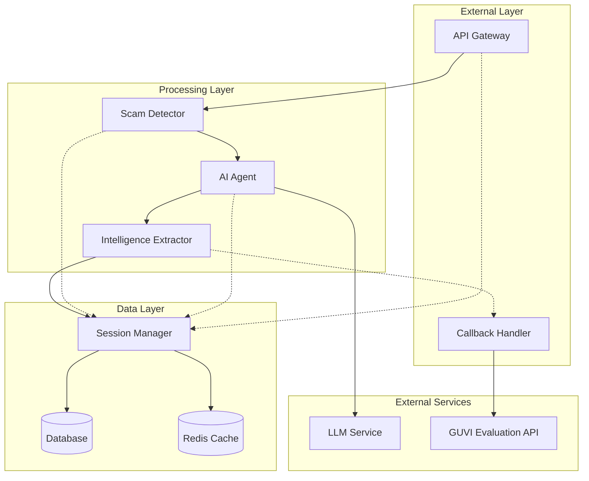

# Design Document: Agentic Honey-Pot for Scam Detection & Intelligence Extraction

## Overview

The Agentic Honey-Pot system is designed as a cloud-native, microservices-based solution that combines advanced natural language processing, machine learning-based scam detection, and autonomous conversational AI to create an intelligent fraud detection and intelligence gathering platform.

The system follows an event-driven architecture where incoming messages trigger a pipeline of analysis, detection, engagement, and intelligence extraction. The core innovation lies in the seamless integration of scam detection with believable AI-powered human impersonation, allowing the system to extract valuable intelligence while maintaining operational security.

Key architectural principles:
- **Stateful Conversations**: Maintain conversation context across multiple message exchanges
- **Adaptive Engagement**: AI agent adapts persona and responses based on scammer behavior
- **Real-time Processing**: Sub-30 second response times for all operations
- **Ethical Boundaries**: Built-in safeguards to prevent misuse and maintain ethical standards
- **Intelligence Focus**: Prioritize extraction of actionable fraud intelligence

## Architecture

The system employs a layered microservices architecture with the following components:



### Component Responsibilities

**API Gateway**: Handles HTTP requests, authentication, input validation, and response formatting. Implements rate limiting and security controls.

**Scam Detector**: Analyzes message content using NLP and ML models to identify fraudulent intent. Maintains classification models for different scam types.

**AI Agent**: Generates human-like responses using large language models. Maintains persona consistency and conversation flow while extracting intelligence.

**Intelligence Extractor**: Processes conversation data to identify and structure scam-related information using pattern matching and entity recognition.

**Session Manager**: Maintains conversation state, handles data persistence, and manages conversation lifecycle.

**Callback Handler**: Manages external API integrations and result reporting to evaluation endpoints.

## Components and Interfaces

### API Gateway Interface

```python
class APIGateway:
    def process_message(self, request: MessageRequest) -> MessageResponse:
        """
        Main entry point for message processing
        
        Args:
            request: Contains sessionId, message, conversationHistory, metadata
            
        Returns:
            MessageResponse with analysis results and agent response
        """
        
    def authenticate(self, api_key: str) -> bool:
        """Validate API key authentication"""
        
    def validate_request(self, request: MessageRequest) -> ValidationResult:
        """Validate request format and required fields"""
```

### Scam Detection Interface

```python
class ScamDetector:
    def analyze_message(self, message: Message, context: ConversationContext) -> ScamAnalysis:
        """
        Analyze message for scam indicators
        
        Returns:
            ScamAnalysis containing detection confidence, scam type, and reasoning
        """
        
    def classify_scam_type(self, message: Message) -> ScamType:
        """Classify the type of scam detected"""
        
    def update_detection_models(self, feedback: DetectionFeedback) -> None:
        """Update ML models based on feedback"""
```

### AI Agent Interface

```python
class AIAgent:
    def generate_response(self, message: Message, context: ConversationContext, 
                         scam_analysis: ScamAnalysis) -> AgentResponse:
        """
        Generate human-like response to continue conversation
        
        Returns:
            AgentResponse with message text and engagement strategy
        """
        
    def maintain_persona(self, context: ConversationContext) -> PersonaState:
        """Ensure consistent persona throughout conversation"""
        
    def self_correct(self, error: ConversationError) -> CorrectionAction:
        """Perform self-correction when errors are detected"""
```

### Intelligence Extraction Interface

```python
class IntelligenceExtractor:
    def extract_intelligence(self, conversation: Conversation) -> ScamIntelligence:
        """
        Extract structured intelligence from conversation
        
        Returns:
            ScamIntelligence with accounts, links, patterns, etc.
        """
        
    def identify_entities(self, text: str) -> List[Entity]:
        """Identify specific entities like phone numbers, accounts"""
        
    def analyze_patterns(self, conversation: Conversation) -> BehaviorPatterns:
        """Analyze scammer behavior patterns"""
```

### Session Management Interface

```python
class SessionManager:
    def create_session(self, session_id: str, metadata: SessionMetadata) -> Session:
        """Create new conversation session"""
        
    def get_session(self, session_id: str) -> Optional[Session]:
        """Retrieve existing session"""
        
    def update_session(self, session_id: str, message: Message, 
                      analysis: ScamAnalysis) -> None:
        """Update session with new message and analysis"""
        
    def close_session(self, session_id: str, final_results: SessionResults) -> None:
        """Close session and trigger final callbacks"""
```

## Data Models

### Core Message Models

```python
@dataclass
class Message:
    sender: str
    text: str
    timestamp: datetime
    message_id: str
    
@dataclass
class MessageRequest:
    session_id: str
    message: Message
    conversation_history: List[Message]
    metadata: RequestMetadata
    
@dataclass
class RequestMetadata:
    channel: str  # SMS, WhatsApp, Email
    language: str
    locale: str
    source_ip: Optional[str]
```

### Analysis and Detection Models

```python
@dataclass
class ScamAnalysis:
    is_scam: bool
    confidence: float
    scam_type: ScamType
    reasoning: str
    risk_indicators: List[str]
    
class ScamType(Enum):
    BANK_FRAUD = "bank_fraud"
    UPI_FRAUD = "upi_fraud"
    PHISHING = "phishing"
    FAKE_OFFER = "fake_offer"
    INVESTMENT_SCAM = "investment_scam"
    ROMANCE_SCAM = "romance_scam"
    TECH_SUPPORT = "tech_support"
```

### Intelligence Models

```python
@dataclass
class ScamIntelligence:
    bank_accounts: List[BankAccount]
    upi_ids: List[str]
    phone_numbers: List[PhoneNumber]
    urls: List[URL]
    keywords: List[str]
    behavior_patterns: BehaviorPatterns
    
@dataclass
class BankAccount:
    account_number: str
    ifsc_code: Optional[str]
    bank_name: Optional[str]
    confidence: float
    
@dataclass
class PhoneNumber:
    number: str
    country_code: str
    is_verified: bool
    confidence: float
    
@dataclass
class URL:
    url: str
    domain: str
    is_malicious: bool
    threat_type: Optional[str]
```

### Session and Conversation Models

```python
@dataclass
class Session:
    session_id: str
    created_at: datetime
    updated_at: datetime
    status: SessionStatus
    messages: List[Message]
    scam_analyses: List[ScamAnalysis]
    extracted_intelligence: ScamIntelligence
    agent_notes: str
    
class SessionStatus(Enum):
    ACTIVE = "active"
    COMPLETED = "completed"
    TERMINATED = "terminated"
    ERROR = "error"
    
@dataclass
class ConversationContext:
    session: Session
    current_persona: PersonaState
    engagement_strategy: EngagementStrategy
    conversation_stage: ConversationStage
```

### Response Models

```python
@dataclass
class MessageResponse:
    status: str
    scam_detected: bool
    agent_response: Optional[str]
    engagement_metrics: EngagementMetrics
    extracted_intelligence: ScamIntelligence
    agent_notes: str
    session_id: str
    
@dataclass
class EngagementMetrics:
    conversation_duration: int  # seconds
    message_count: int
    engagement_quality: float
    intelligence_score: float
```

## Correctness Properties

*A property is a characteristic or behavior that should hold true across all valid executions of a system—essentially, a formal statement about what the system should do. Properties serve as the bridge between human-readable specifications and machine-verifiable correctness guarantees.*

Based on the prework analysis and property reflection, the following properties ensure system correctness:

### Property 1: Authentication enforcement
*For any* HTTP request to the API Gateway, requests without valid x-api-key headers should be rejected with HTTP 401, while requests with valid headers should be processed successfully
**Validates: Requirements 1.2, 1.3**

### Property 2: Request validation consistency
*For any* malformed request sent to the API Gateway, the system should return HTTP 400 status regardless of the specific malformation type
**Validates: Requirements 1.4**

### Property 3: Response time compliance
*For any* valid request under normal load conditions, the system should respond within 30 seconds
**Validates: Requirements 8.1**

### Property 4: Session creation determinism
*For any* new sessionId, the Session Manager should create exactly one new conversation context and subsequent requests with the same sessionId should retrieve the existing context
**Validates: Requirements 2.1, 2.2**

### Property 5: Message chronological ordering
*For any* sequence of messages added to a session, the Session Manager should maintain them in chronological order based on timestamps
**Validates: Requirements 2.3**

### Property 6: Metadata preservation
*For any* session created with metadata (channel, language, locale), the Session Manager should preserve this metadata throughout the session lifecycle
**Validates: Requirements 2.4**

### Property 7: History validation consistency
*For any* request containing conversationHistory, the Session Manager should validate it matches stored history and reject mismatches consistently
**Validates: Requirements 2.5**

### Property 8: Universal message analysis
*For any* message received by the system, the Scam Detector should perform analysis and return a classification result
**Validates: Requirements 3.1**

### Property 9: Scam classification completeness
*For any* message classified as a scam, the Scam Detector should assign both a scam type and confidence level
**Validates: Requirements 3.3**

### Property 10: Non-scam handling consistency
*For any* message classified as non-scam, the system should return negative classification without activating the AI Agent
**Validates: Requirements 3.5**

### Property 11: Agent activation on scam detection
*For any* message classified as a scam, the AI Agent should activate and generate a response
**Validates: Requirements 4.1**

### Property 12: Comprehensive entity extraction
*For any* message containing bank accounts, UPI IDs, phone numbers, or URLs, the Intelligence Extractor should identify and extract these entities with appropriate confidence scores
**Validates: Requirements 5.1, 5.2, 5.3, 5.4**

### Property 13: Structured data formatting
*For any* intelligence extracted from conversations, the data should conform to the standardized ScamIntelligence format with all required fields
**Validates: Requirements 5.6**

### Property 14: Response structure compliance
*For any* API response, it should be valid JSON containing status, scamDetected, engagementMetrics, extractedIntelligence, and agentNotes fields
**Validates: Requirements 6.1, 6.2, 6.4, 6.5**

### Property 15: Scam detection field accuracy
*For any* response where a scam was detected, the scamDetected field should be set to true, and for non-scam responses, it should be false
**Validates: Requirements 6.3**

### Property 16: Callback execution reliability
*For any* concluded conversation, the Callback Handler should send results to the GUVI evaluation endpoint exactly once
**Validates: Requirements 7.1**

### Property 17: Callback payload completeness
*For any* callback sent to the evaluation endpoint, it should include sessionId, scamDetected, totalMessagesExchanged, extractedIntelligence, and agentNotes
**Validates: Requirements 7.3, 7.4**

### Property 18: Retry mechanism consistency
*For any* failed callback attempt, the Callback Handler should retry up to 3 times with exponential backoff before giving up
**Validates: Requirements 7.5**

### Property 19: Concurrent session isolation
*For any* set of concurrent sessions, operations on one session should not corrupt data in other sessions
**Validates: Requirements 8.4**

### Property 20: Error logging completeness
*For any* error or performance event in the system, appropriate logs should be generated for monitoring purposes
**Validates: Requirements 8.5**

### Property 21: Data encryption invariant
*For any* conversation data stored by the system, it should be encrypted using the configured encryption method
**Validates: Requirements 10.1**

### Property 22: Log sanitization consistency
*For any* log entry generated by the system, sensitive data (API keys, personal information) should be sanitized or redacted
**Validates: Requirements 10.4**

## Error Handling

The system implements comprehensive error handling across all components:

### API Gateway Error Handling
- **Authentication Errors**: Return HTTP 401 with clear error messages for missing or invalid API keys
- **Validation Errors**: Return HTTP 400 with detailed field-level validation errors
- **Rate Limiting**: Return HTTP 429 when rate limits are exceeded
- **Internal Errors**: Return HTTP 500 with sanitized error messages, log full details internally

### Scam Detection Error Handling
- **Model Loading Failures**: Gracefully degrade to rule-based detection with reduced accuracy warnings
- **Analysis Timeouts**: Return low-confidence classification after timeout threshold
- **Invalid Input**: Handle malformed text gracefully without crashing

### AI Agent Error Handling
- **LLM Service Failures**: Implement fallback responses and retry logic with exponential backoff
- **Context Overflow**: Summarize conversation history when context limits are reached
- **Generation Failures**: Provide generic but appropriate responses to maintain conversation flow
- **Ethical Boundary Violations**: Implement automatic response filtering and conversation termination

### Intelligence Extraction Error Handling
- **Entity Recognition Failures**: Continue processing with partial results, log extraction failures
- **Pattern Matching Errors**: Gracefully handle regex failures and malformed patterns
- **Data Structuring Errors**: Provide default values for missing fields, maintain schema compliance

### Session Management Error Handling
- **Database Connection Failures**: Implement connection pooling and automatic reconnection
- **Session Corruption**: Detect and recover from corrupted session data
- **Concurrent Access**: Handle race conditions with proper locking mechanisms
- **Storage Failures**: Implement backup storage and data recovery procedures

### Callback Error Handling
- **Network Failures**: Implement retry logic with exponential backoff and circuit breaker patterns
- **Endpoint Unavailability**: Queue callbacks for later delivery with persistent storage
- **Payload Serialization Errors**: Log errors and attempt simplified payload delivery

## Testing Strategy

The system employs a dual testing approach combining unit tests for specific scenarios with property-based tests for comprehensive coverage:

### Unit Testing Focus
- **Specific Examples**: Test concrete scam detection scenarios with known inputs and expected outputs
- **Edge Cases**: Test boundary conditions like empty messages, maximum length inputs, and malformed data
- **Integration Points**: Test component interactions and data flow between services
- **Error Conditions**: Test specific error scenarios and recovery mechanisms

### Property-Based Testing Configuration
- **Testing Library**: Use Hypothesis for Python implementation to generate diverse test inputs
- **Iteration Count**: Configure minimum 100 iterations per property test for thorough coverage
- **Test Tagging**: Each property test references its design document property with format:
  ```python
  # Feature: agentic-honeypot, Property 1: Authentication enforcement
  ```

### Property Test Implementation Strategy
- **Input Generation**: Create generators for messages, session data, and API requests
- **Invariant Verification**: Verify system properties hold across all generated inputs
- **Shrinking**: Use automatic test case shrinking to find minimal failing examples
- **Seed Management**: Use deterministic seeds for reproducible test runs

### Testing Coverage Areas
- **API Contract Testing**: Verify all endpoints conform to OpenAPI specifications
- **Scam Detection Accuracy**: Test detection rates across various scam types and languages
- **Conversation Flow Testing**: Verify multi-turn conversation handling and state management
- **Intelligence Extraction Precision**: Test entity extraction accuracy and completeness
- **Performance Testing**: Verify response time requirements under various load conditions
- **Security Testing**: Test authentication, authorization, and data protection mechanisms

### Continuous Testing Integration
- **Automated Test Execution**: Run all tests on every code change
- **Performance Regression Detection**: Monitor and alert on performance degradation
- **Security Scanning**: Automated vulnerability scanning and dependency checking
- **Load Testing**: Regular load testing to verify scalability requirements